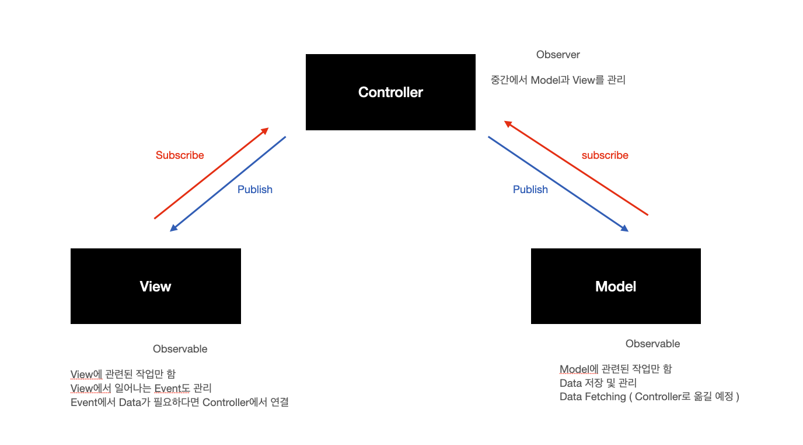

# fe-w45-kanbantodo

## 구조

## 할 일 / 한 일

### Day1

- 개발 환경 설정
  - [x] webpack
  - [x] Babel
- 레이아웃 구현
  - [x] 헤더 구현
  - [x] TODO 탭 구현
  - [ ] 모달창 구현
- API 생성
  - [x] 백앤드 환경 설정
  - [x] Mongo DB 설치
- MVC 패턴 구현
  - [x] TODO를 MVC 패턴으로 구현

### Day2

- 레이아웃 구현
- [ ] 모달창 구현
  - [x] 카카오스럽게 디자인해보기
- API 생성
  - [x] TODO 읽기
  - [x] TODO 생성하기
  - [x] TODO 수정하기
  - [x] TODO 지우기
- 기능 구현
  - [x] 추가 버튼 기능 구현
  - [x] 삭제 버튼 기능 구현
  - [x] 여러 개의 Todo List 생성 가능하도록 수정

### Day3

- [ ] 리팩토링
- [ ] 드래그앤드롭 구현
- [ ] 웹팩 production 구현
- [ ] 메뉴 창 구현

### Day4

### Day5
